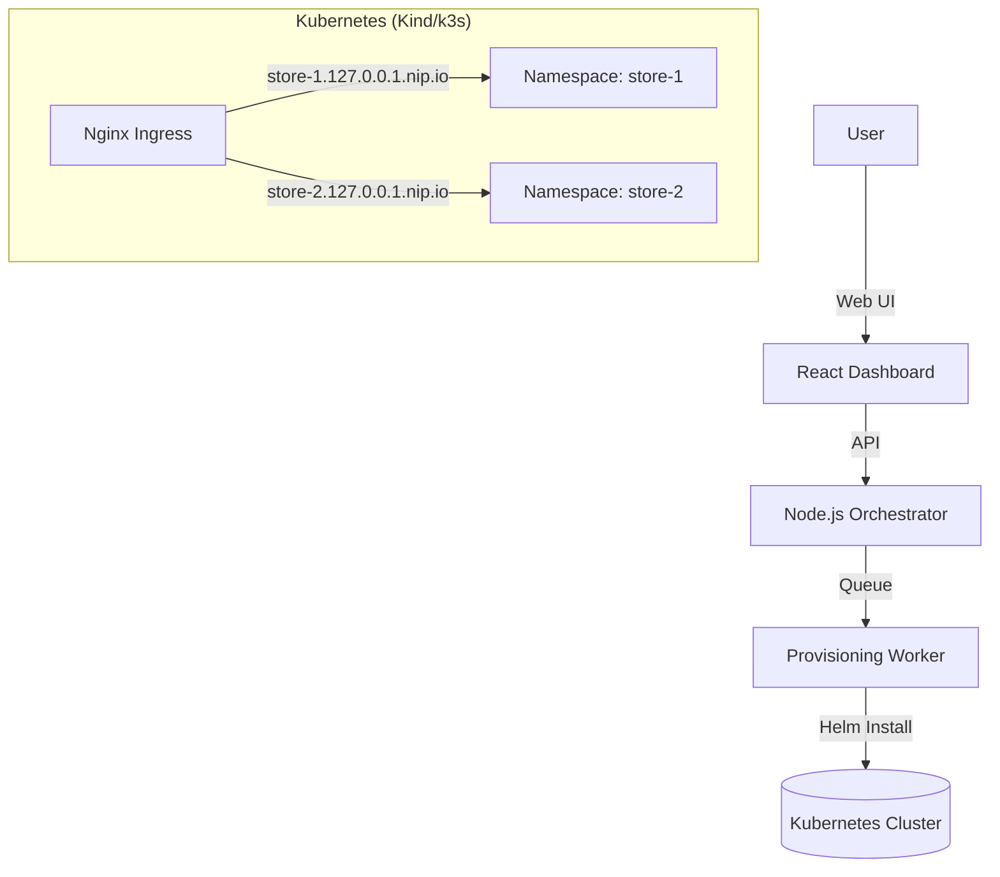

# 🛍️ WooStore - Kubernetes Store Provisioning Platform

A production-ready platform to provision fully functional, isolated **WooCommerce** stores on Kubernetes in under 3 minutes. Built for the **Urumi Systems SDE Internship Challenge**.


---

## 🚀 Features

### Core Functionality
- **Instant Provisioning**: Deploys WordPress + MySQL + Ingress via Helm.
- **Full Automation**: Auto-configures database, WP-CLI setup, products, and currency (INR).
- **Dashboard**: Real-time React UI for improved store management.
- **Isolated**: Namespace-per-tenant architecture.

### 🌟 Bonus "Stand Out" Features Implemented
1.  **Concurrency Controls**: Max 2 concurrent stores (others queued).
2.  **Abuse Prevention**: Global Quota (Max 50 stores), Queue limits.
3.  **Isolation & Guardrails**: `ResourceQuota` & `LimitRange` per namespace.
4.  **Idempotency & Recovery**: Auto-recovers from interrupted provisioning on restart.
5.  **Upgrades & Rollbacks**: Native Helm support for safe version changes.
6.  **Observability**: Detailed event logging in Dashboard.

---

## 🏗️ System Design & Architecture

The platform follows a **Controller/Orchestrator** pattern:



### Tradeoffs & Decisions
| Aspect | Decision | Tradeoff |
| :--- | :--- | :--- |
| **Isolation** | Namespace-per-tenant | Strong isolation but higher resource overhead per store. |
| **Storage** | Dynamic PVCs | Persistent data survives pod restarts but requires storage class support. |
| **Orchestration** | In-memory Queue | Simple to implement but state is lost on crash (Mitigated by startup recovery scan). |
| **Ingress** | `nip.io` wildcard | Zero-config for local dev, but not suitable for production SSL (Use real DNS in prod). |

### Ingress & Domains
- **Local**: Each store is served at `http://<storeId>.127.0.0.1.nip.io` using NGINX Ingress.
- **How it works**: Helm sets the host to `<storeId>.<clusterIP>.nip.io` with `clusterIP=127.0.0.1` locally.
- **Production**: Set `clusterIP` to your VPS public IP (e.g., `A.B.C.D`) so hosts resolve to `<storeId>.A.B.C.D.nip.io`.
- **DNS note**: For real domains and TLS, use proper DNS and set `ingress.className` and cert-manager accordingly.

---

## 🛠️ Local Setup (How to Run)

### Prerequisites
- **Docker Desktop** (running)
- **Node.js** (v18+)
- **Helm** (installed via Chocolatey/Brew)
- **Kubernetes Cluster** (Kind or Docker Desktop K8s)

### ONE-CLICK SETUP
We have provided automated scripts to set up the environment:

**Windows (PowerShell):**
```powershell
.\setup.ps1
```

**Linux/Mac:**
```bash
./setup.sh
```

### Manual Steps
1.  **Start Backend**:
    ```bash
    cd backend
    npm install
    npm run dev
    ```
2.  **Start Dashboard**:
    ```bash
    cd dashboard
    npm install
    npm run dev
    ```
3.  **Access**: Open `http://localhost:3001`

---

## ☁️ Production Setup (VPS / k3s)

To deploy to a production environment (e.g., DigitalOcean Droplet with k3s):

1.  **Infrastructure**: Install k3s (`curl -sfL https://get.k3s.io | sh -`).
2.  **Configuration**:
    - Edit `helm/store-template/values.yaml` and ensure `ingress.className: "nginx"`.
    - Set `ingress.clusterIP` to your **public IP** (e.g., `203.0.113.42`).
    - Optionally install NGINX Ingress on k3s or switch to Traefik by setting `ingress.className: "traefik"`.
    - Update backend `.env` with `CLUSTER_IP=<your public IP>`.
3.  **Deploy Backend**: Run the Node.js backend on the Docker and expose port `3000`.
4.  **Dashboard**: Serve the React dashboard (e.g., `vite build` + static hosting) and proxy `/api` to the backend.
5.  **Scaling**: For horizontal scaling, externalize the queue (e.g., Redis) and run multiple orchestrator replicas.

---

## 🛒 Usage Guide

1.  **Create Store**: Click **"New Store"** -> Enter "My Shop".
2.  **Wait**: Watch the status move from `Queued` -> `Provisioning` -> `Ready`.
3.  **Access**: Click **"Storefront"** to visit the shop (Login: `admin` / Password: *See Dashboard*).
4.  **Manage**: Delete stores safely via the UI (full cleanup).

### Place an Order (Definition of Done)
- Open the storefront at `http://<storeId>.127.0.0.1.nip.io`.
- Add any product to the cart.
- Proceed to checkout and select **Cash on Delivery**.
- Complete the order and confirm it appears in **WooCommerce Admin** (`/wp-admin`).

---

## 📂 Project Structure

```
├── backend/                 # Node.js Express Server + Orchestrator
│   ├── services/            # Logic (HelmClient, KubernetesClient)
│   ├── config/              # Database & K8s Config
├── dashboard/               # React + Tailwind Frontend
├── helm/                    # Helm Charts
│   └── store-template/      # The Main Chart (WordPress+MySQL)
├── setup.ps1                # Auto-setup script
└── README.md                # This file
```

---

## ⚙️ Helm & Values
- Per-store deployments use the `helm/store-template` chart.
- The backend sets `storeId`, `storeName`, `namespace`, MySQL credentials, and `ingress.clusterIP` on install.
- Platform values:
  - Local: `helm/store-platform/values-local.yaml`
  - Prod: `helm/store-platform/values-prod.yaml`

## 🔒 Reliability & Cleanup
- Idempotency: Unique `storeId` per request; provisioning can be retried safely.
- Failure handling: Timeouts mark stores as failed and trigger cleanup.
- Recovery: On restart, the orchestrator scans and resolves stuck provisions.
- Cleanup: Deleting a store uninstalls the Helm release (if present) and deletes the namespace.

## ✅ Verification
- Health: `http://localhost:3000/health`
- Metrics: `http://localhost:3000/api/metrics`
- Stores API: `http://localhost:3000/api/stores`
- Kubernetes: `kubectl get ingress --all-namespaces`, `kubectl get pods --all-namespaces`

