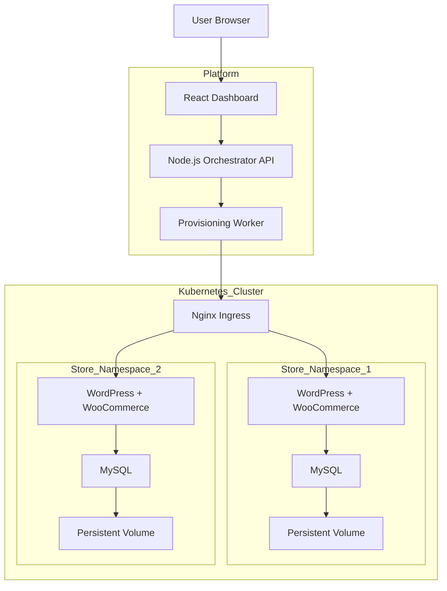

# 🛍️ WooStore - Kubernetes Store Provisioning Platform

A production-ready platform to provision fully functional, isolated **WooCommerce** stores on Kubernetes in under 3 minutes. Built for the **Urumi Systems SDE Internship Challenge**.


---

## 🚀 Features

### Core Functionality
- **Instant Provisioning**: Deploys WordPress + MySQL + Ingress via Helm.
- **Full Automation**: Auto-configures database, WP-CLI setup, products, and currency (INR).
- **Dashboard**: Real-time React UI for improved store management.
- **Isolated**: Namespace-per-tenant architecture.

### 🌟 Bonus "Stand Out" Features Implemented
1.  **Concurrency Controls**: Max 2 concurrent stores (others queued).
2.  **Abuse Prevention**: Global Quota (Max 50 stores), Queue limits.
3.  **Isolation & Guardrails**: `ResourceQuota` & `LimitRange` per namespace.
4.  **Idempotency & Recovery**: Auto-recovers from interrupted provisioning on restart.
5.  **Observability**: Detailed event logging in Dashboard.

---

## 🏗️ System Design & Architecture

The platform follows a **Controller/Orchestrator** pattern:


The platform follows a controller–orchestrator architecture.

1. The user interacts with the React dashboard.
2. The dashboard calls the Node.js backend API.
3. The backend enqueues store provisioning requests.
4. A worker processes the queue and installs a Helm chart.
5. Kubernetes creates a dedicated namespace per store.
6. Each store runs:
   - WordPress + WooCommerce
   - MySQL database
   - Persistent storage
   - Ingress for public access

### Tradeoffs & Decisions
| Aspect | Decision | Tradeoff |
| :--- | :--- | :--- |
| **Isolation** | Namespace-per-tenant | Strong isolation but higher resource overhead per store. |
| **Storage** | Dynamic PVCs | Persistent data survives pod restarts but requires storage class support. |
| **Orchestration** | In-memory Queue | Simple to implement but state is lost on crash (Mitigated by startup recovery scan). |
| **Ingress** | `nip.io` wildcard | Zero-config for local dev, but not suitable for production SSL (Use real DNS in prod). |

### Ingress & Domains
- **Local**: Each store is served at `http://<storeId>.127.0.0.1.nip.io` using NGINX Ingress.
- **How it works**: Helm sets the host to `<storeId>.<clusterIP>.nip.io` with `clusterIP=127.0.0.1` locally.
- **Production**: Set `clusterIP` to your VPS public IP (e.g., `A.B.C.D`) so hosts resolve to `<storeId>.A.B.C.D.nip.io`.
- **DNS note**: For real domains and TLS, use proper DNS and set `ingress.className` and cert-manager accordingly.

---

## 🛠️ Local Setup (How to Run)

### Prerequisites
- **Docker Desktop** (running)
- **Node.js** (v18+)
- **Helm** (installed via Chocolatey/Brew)
- **Kubernetes Cluster** (Kind or Docker Desktop K8s)

### ONE-CLICK SETUP
We have provided automated scripts to set up the environment:

**Windows (PowerShell):**
```powershell
.\setup.ps1
```

**Linux/Mac:**
```bash
./setup.sh
```

### Manual Steps
1.  **Start Backend**:
    ```bash
    cd backend
    npm install
    npm run dev
    ```
2.  **Start Dashboard**:
    ```bash
    cd dashboard
    npm install
    npm run dev
    ```
3.  **Access**: Open `http://localhost:3001`

---

## 🛒 Usage Guide

1.  **Create Store**: Click **"New Store"** -> Enter "My Shop".
2.  **Wait**: Watch the status move from `Queued` -> `Provisioning` -> `Ready`.
3.  **Access**: Click **"Storefront"** to visit the shop (Login: `admin` / Password: *See Dashboard*).
4.  **Manage**: Delete stores safely via the UI (full cleanup).

### Place an Order (Definition of Done)
- Open the storefront at `http://<storeId>.127.0.0.1.nip.io`.
- Add any product to the cart.
- Proceed to checkout and select **Cash on Delivery**.
- Complete the order and confirm it appears in **WooCommerce Admin** (`/wp-admin`).

---

## 📂 Project Structure

```
├── backend/                 # Node.js Express Server + Orchestrator
│   ├── services/            # Logic (HelmClient, KubernetesClient)
│   ├── config/              # Database & K8s Config
├── dashboard/               # React + Tailwind Frontend
├── helm/                    # Helm Charts
│   └── store-template/      # The Main Chart (WordPress+MySQL)
├── setup.ps1                # Auto-setup script
└── README.md                # This file
```

---

## ⚙️ Helm & Values
- Per-store deployments use the `helm/store-template` chart.
- The backend sets `storeId`, `storeName`, `namespace`, MySQL credentials, and `ingress.clusterIP` on install.
- Platform values:
  - Local: `helm/store-platform/values-local.yaml`
  - Prod: `helm/store-platform/values-prod.yaml`

## 🔒 Reliability & Cleanup
- Idempotency: Unique `storeId` per request; provisioning can be retried safely.
- Failure handling: Timeouts mark stores as failed and trigger cleanup.
- Recovery: On restart, the orchestrator scans and resolves stuck provisions.
- Cleanup: Deleting a store uninstalls the Helm release (if present) and deletes the namespace.

## ✅ Verification
- Health: `http://localhost:3000/health`
- Metrics: `http://localhost:3000/api/metrics`
- Stores API: `http://localhost:3000/api/stores`
- Kubernetes: `kubectl get ingress --all-namespaces`, `kubectl get pods --all-namespaces`

---

## 📦 Deliverables (Round 1)

- Local setup instructions
  - One‑click scripts: `setup.ps1`, `setup.sh`
  - Manual steps section covers backend and dashboard dev servers

- How to create a store and place an order
  - UI steps under “Usage Guide” and “Place an Order” above
  - API option:
    ```bash
    curl -X POST http://localhost:3000/api/stores \
      -H "Content-Type: application/json" \
      -d '{"name":"Test Store","type":"woocommerce"}'
    ```

- Source code included
  - Backend (`backend/`): Express API, PostgreSQL, orchestrator, Kubernetes client
  - Dashboard (`dashboard/`): React + Vite + Tailwind UI
  - Provisioning (`backend/services/orchestrator.js`, `backend/services/helmClient.js`)

- Helm charts + values files
  - Per‑store chart: `helm/store-template` (WordPress + MySQL + Ingress + PVCs)
  - Platform values: `helm/store-platform/values-local.yaml`, `helm/store-platform/values-prod.yaml`

---

## 📝 System Design & Tradeoffs (Short Note)

- Architecture choice
  - Controller/Orchestrator pattern
  - Backend computes host and invokes Helm per store
  - Dashboard polls API for status and events
  - References: `backend/services/orchestrator.js:196`, `backend/services/helmClient.js:21`, `dashboard/src/App.jsx:29`

- Idempotency / failure handling / cleanup
  - Unique `storeId` avoids collisions; retries safe
  - 10‑minute timeout with failure marking and namespace cleanup
  - Recovery scan on boot marks stuck provisions as failed
  - References: `backend/services/orchestrator.js:160`, `backend/services/orchestrator.js:175`, `backend/services/orchestrator.js:25`, `backend/services/kubernetesClient.js:138`

- Production differences
  - DNS: `<storeId>.<clusterIP>.nip.io` → set `CLUSTER_IP` to VPS public IP
  - Ingress: switch class to `nginx` or `traefik` in values
  - Storage: set storageClass (e.g., `local-path` on k3s) and larger PVC sizes
  - Secrets: generated at install time; no hardcoded secrets in source
  - References: `helm/store-template/templates/ingress.yaml:14`, `helm/store-template/values.yaml:31-35`, `helm/store-platform/values-prod.yaml:1-11`, `backend/services/helmClient.js:21`

---

## 🌟 Ways to Stand Out (Implemented)

- Stronger multi‑tenant isolation and guardrails
  - Namespace‑level `ResourceQuota` and `LimitRange` applied per store
  - References: `helm/store-template/templates/resourcequota.yaml:8`, `helm/store-template/templates/limit-range.yaml:8`

- Idempotency and recovery
  - Safe retries via unique `storeId`; reconcile cleans up on failure
  - Recovery scan marks in‑progress stores as failed after restart
  - References: `backend/services/orchestrator.js:25`, `backend/services/orchestrator.js:80`, `backend/services/orchestrator.js:160`

- Abuse prevention beyond rate limiting
  - Global caps and queue limits; per‑API active store cap with 429
  - Provisioning timeout with failure status and cleanup
  - Audit trail via `store_events` and `/api/events`
  - References: `backend/services/orchestrator.js:15`, `backend/services/orchestrator.js:169`, `backend/services/stores.js:61`, `backend/server.js:61`

- Observability
  - Activity log surface in dashboard; backend metrics endpoint
  - References: `dashboard/src/App.jsx:25`, `backend/server.js:28`, `backend/server.js:61`

- Scaling plan (implemented)
  - Concurrency controls in orchestrator; platform replicas in prod values
  - References: `backend/services/orchestrator.js:12`, `helm/store-platform/values-prod.yaml:20`, `helm/store-platform/values-prod.yaml:26`

### Not Yet Implemented
- Production‑like VPS deployment demo (live VPS with same charts)
- Network and security hardening (RBAC, NetworkPolicies, non‑root)
- Upgrades and rollback demonstration

