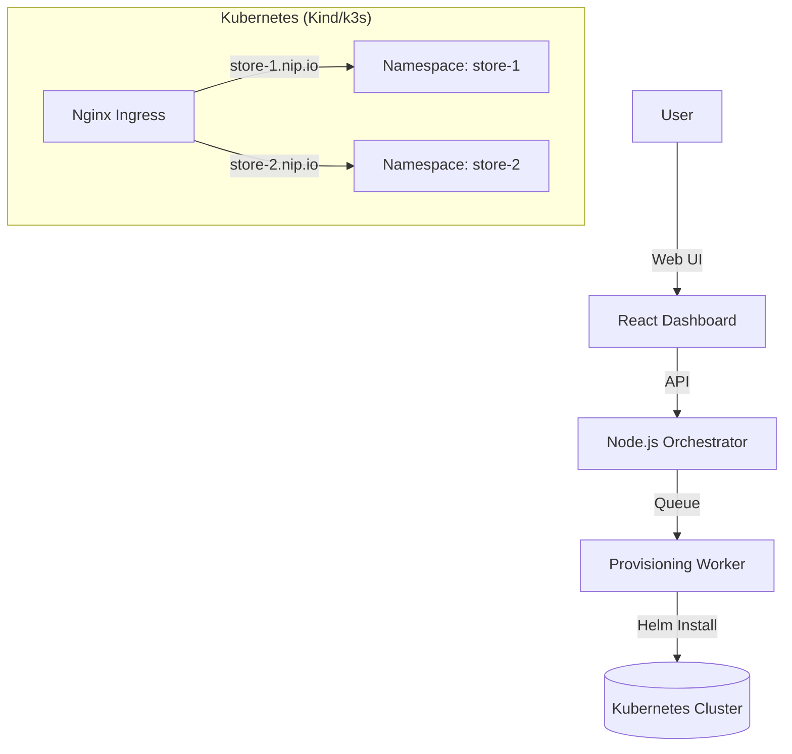

# 🛍️ WooStore - Kubernetes Store Provisioning Platform

A production-ready platform to provision fully functional, isolated **WooCommerce** stores on Kubernetes in under 3 minutes. Built for the **Urumi Systems SDE Internship Challenge**.


---

## 🚀 Features

### Core Functionality
- **Instant Provisioning**: Deploys WordPress + MySQL + Ingress via Helm.
- **Full Automation**: Auto-configures database, WP-CLI setup, products, and currency (INR).
- **Dashboard**: Real-time React UI for improved store management.
- **Isolated**: Namespace-per-tenant architecture.

### 🌟 Bonus "Stand Out" Features Implemented
1.  **Concurrency Controls**: Max 2 concurrent stores (others queued).
2.  **Abuse Prevention**: Global Quota (Max 50 stores), Queue limits.
3.  **Isolation & Guardrails**: `ResourceQuota` & `LimitRange` per namespace.
4.  **Idempotency & Recovery**: Auto-recovers from interrupted provisioning on restart.
5.  **Upgrades & Rollbacks**: Native Helm support for safe version changes.
6.  **Observability**: Detailed event logging in Dashboard.

---

## 🏗️ System Design & Architecture

The platform follows a **Controller/Orchestrator** pattern:



### Tradeoffs & Decisions
| Aspect | Decision | Tradeoff |
| :--- | :--- | :--- |
| **Isolation** | Namespace-per-tenant | Strong isolation but higher resource overhead per store. |
| **Storage** | Dynamic PVCs | Persistent data survives pod restarts but requires storage class support. |
| **Orchestration** | In-memory Queue | Simple to implement but state is lost on crash (Mitigated by startup recovery scan). |
| **Ingress** | `nip.io` wildcard | Zero-config for local dev, but not suitable for production SSL (Use real DNS in prod). |

---

## 🛠️ Local Setup (How to Run)

### Prerequisites
- **Docker Desktop** (running)
- **Node.js** (v18+)
- **Helm** (installed via Chocolatey/Brew)
- **Kubernetes Cluster** (Kind or Docker Desktop K8s)

### ONE-CLICK SETUP
We have provided automated scripts to set up the environment:

**Windows (PowerShell):**
```powershell
.\setup.ps1
```

**Linux/Mac:**
```bash
./setup.sh
```

### Manual Steps
1.  **Start Backend**:
    ```bash
    cd backend
    npm install
    npm run dev
    ```
2.  **Start Dashboard**:
    ```bash
    cd dashboard
    npm install
    npm run dev
    ```
3.  **Access**: Open `http://localhost:5173`

---

## ☁️ Production Setup (VPS / k3s)

To deploy to a production environment (e.g., DigitalOcean Droplet with k3s):

1.  **Infrastructure**: Install k3s (`curl -sfL https://get.k3s.io | sh -`).
2.  **Configuration**:
    *   Edit `helm/store-template/values.yaml`.
    *   Enable `persistence.storageClass: "local-path"` (or specific cloud class).
    *   Set `ingress.className: "nginx"`.
    *   Update `ingress.clusterIP` to your **Public IP**.
3.  **Deploy Backend**: Dockerize the Node.js app and run it on the server (or in K8s).
4.  **Scaling**: The orchestrator can be scaled horizontally by moving the job queue to Redis.

---

## 🛒 Usage Guide

1.  **Create Store**: Click **"New Store"** -> Enter "My Shop".
2.  **Wait**: Watch the status move from `Queued` -> `Provisioning` -> `Ready`.
3.  **Access**: Click **"Storefront"** to visit the shop (Login: `admin` / Password: *See Dashboard*).
4.  **Manage**: Delete stores safely via the UI (full cleanup).

---

## 📂 Project Structure

```
├── backend/                 # Node.js Express Server + Orchestrator
│   ├── services/            # Logic (HelmClient, KubernetesClient)
│   ├── config/              # Database & K8s Config
├── dashboard/               # React + Tailwind Frontend
├── helm/                    # Helm Charts
│   └── store-template/      # The Main Chart (WordPress+MySQL)
├── setup.ps1                # Auto-setup script
└── README.md                # This file
```

---

